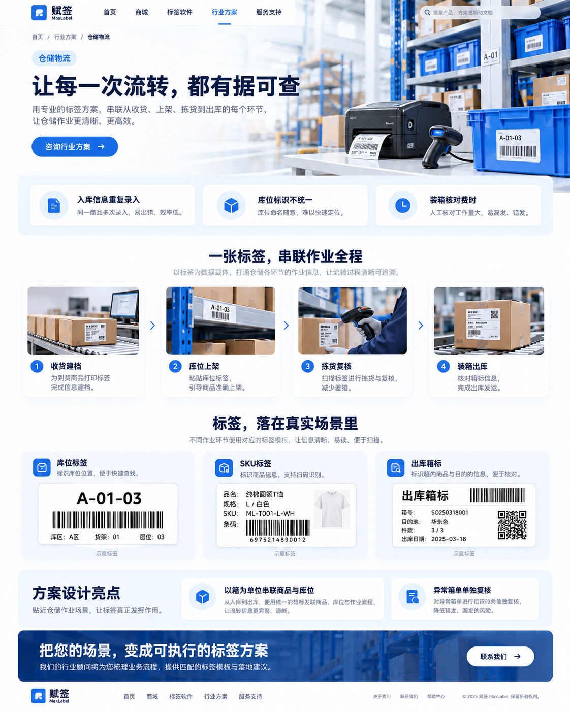
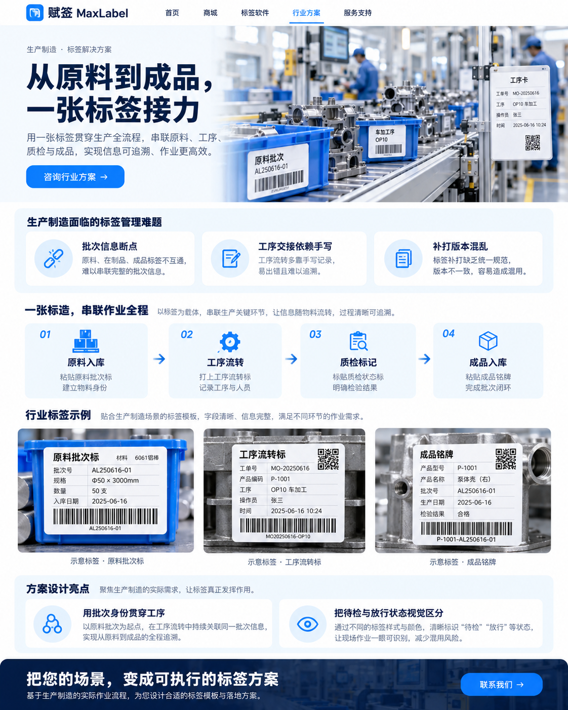
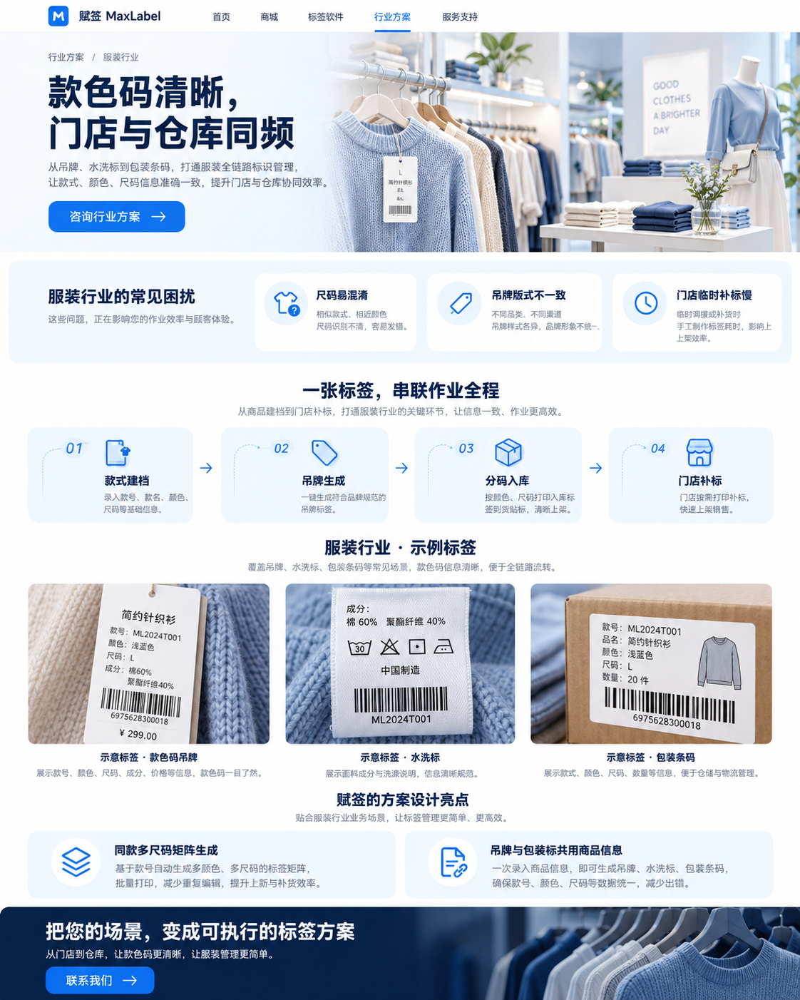
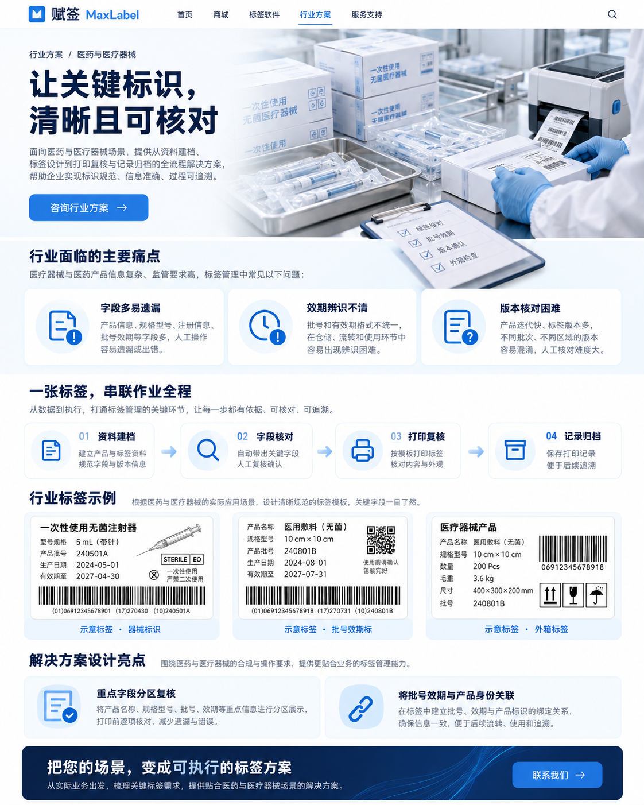
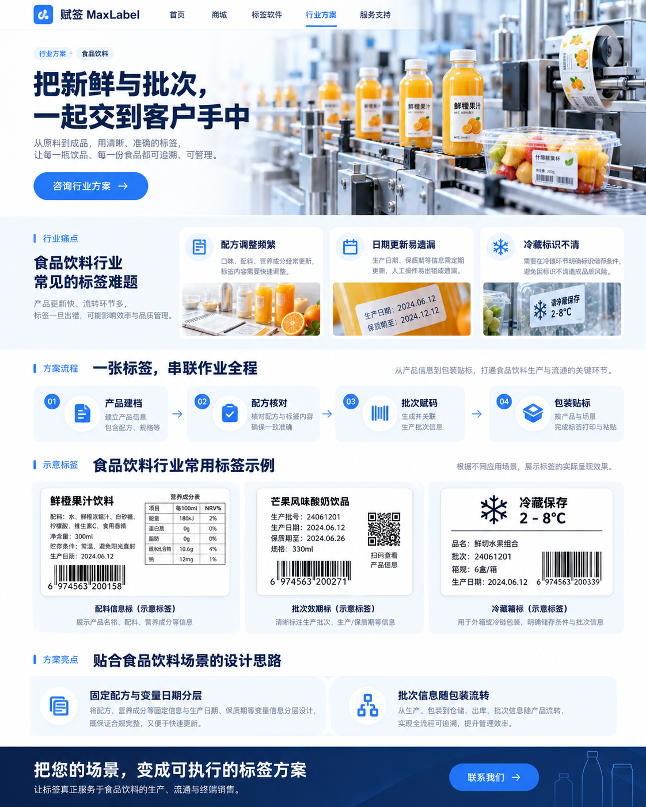
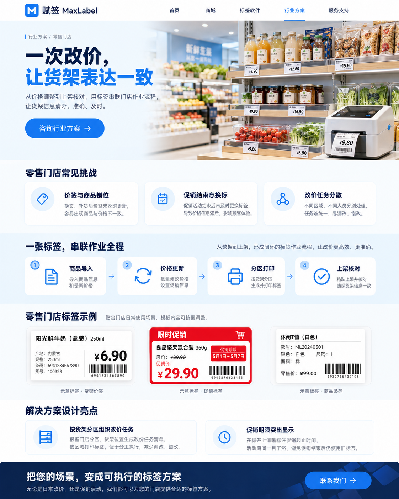
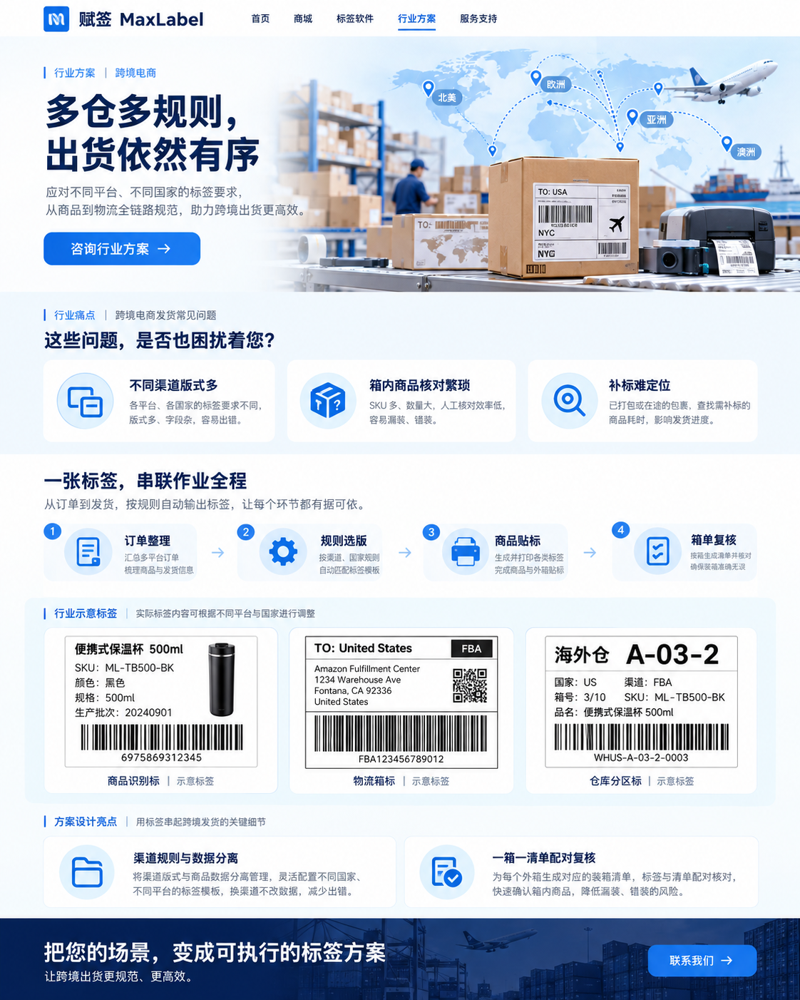
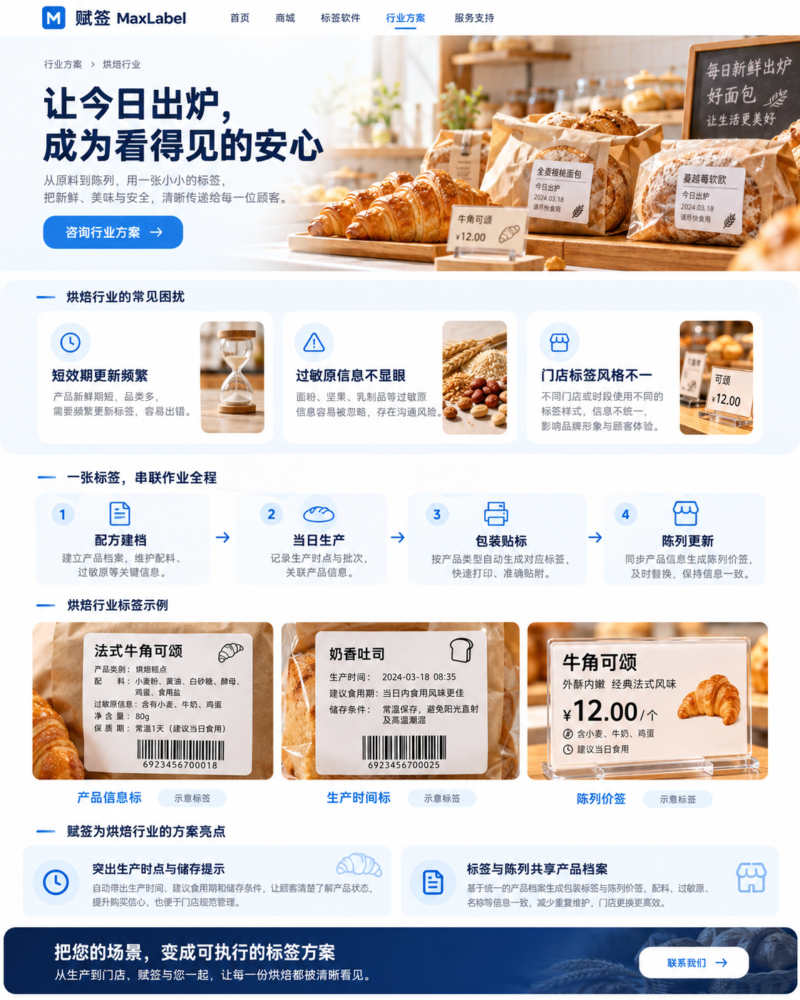
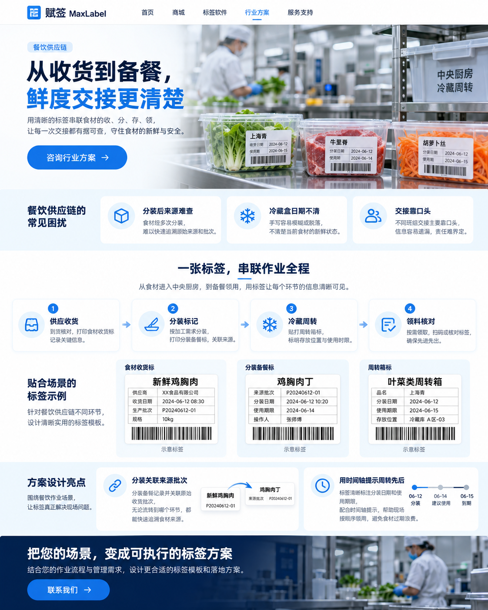
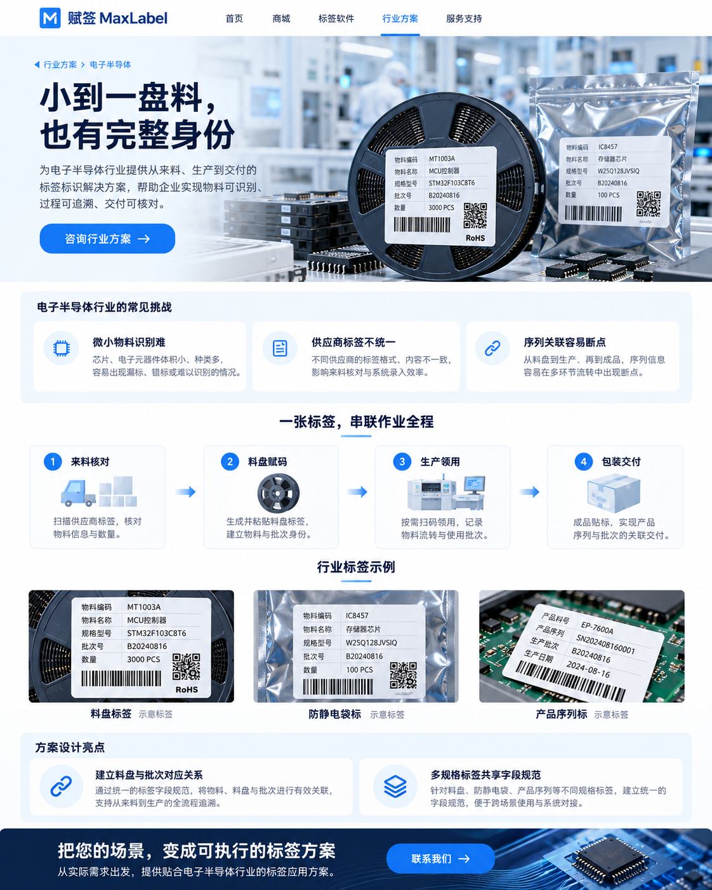

# 赋签 MaxLabel · 十大行业方案设计

2026-10-08 · 视觉设计提案，尚未上线。

视觉基线：沿用 storefront/src/styles/design.css 的品牌蓝 #2E7CD6、标题深蓝 #0C2148、浅蓝背景 #F3F8FF、14px 圆角卡片。线上站点本次未能访问，按当前仓库样式匹配。

原创设计主线：场景 → 痛点 → 标签驱动作业流程 → 标签样例 → 方案设计亮点 → 咨询入口。图中标签、条码和界面仅为视觉示意；正式上线使用下列可编辑文案，条码须由实际数据生成。方案描述为建议方向，功能对接需结合实际产品能力确认。

参考：https://www.dlabel.cn/productIntro （仅参考行业应用类型，未复用图片、布局或文案）。

## 仓储物流

主标题：让每一次流转，都有据可查

场景：货架与周转箱、扫码枪、标签打印机

痛点：入库信息重复录入；库位标识不统一；装箱核对费时

流程：收货建档 → 库位上架 → 拣货复核 → 装箱出库

标签样例：库位标签 / SKU标签 / 出库箱标

设计亮点：以箱为单位串联商品与库位；异常箱单单独复核

## 生产制造

主标题：从原料到成品，一张标签接力

场景：明亮工厂装配线、零件周转盒、工序卡

痛点：批次信息断点；工序交接依赖手写；补打版本混乱

流程：原料入库 → 工序流转 → 质检标记 → 成品入库

标签样例：原料批次标 / 工序流转标 / 成品铭牌

设计亮点：用批次身份贯穿工序；把待检与放行状态视觉区分

## 服装行业

主标题：款色码清晰，门店与仓库同频

场景：简洁服装店、挂架、针织衣物与服装吊牌

痛点：尺码易混淆；吊牌版式不一致；门店临时补标慢

流程：款式建档 → 吊牌生成 → 分码入库 → 门店补标

标签样例：款色码吊牌 / 水洗标 / 包装条码

设计亮点：同款多尺码矩阵生成；吊牌与包装标共用商品信息

## 医药与医疗器械

主标题：让关键标识，清晰且可核对

场景：洁净医疗器械包装工作台、封装盒、标签复核

痛点：字段多易遗漏；效期辨识不清；版本核对困难

流程：资料建档 → 字段核对 → 打印复核 → 记录归档

标签样例：器械标识 / 批号效期标 / 外箱标签

设计亮点：重点字段分区复核；将批号效期与产品身份关联

## 食品饮料

主标题：把新鲜与批次，一起交到客户手中

场景：现代饮品包装线、果汁瓶与食品包装

痛点：配方调整频繁；日期更新易遗漏；冷藏标识不清

流程：产品建档 → 配方核对 → 批次赋码 → 包装贴标

标签样例：配料信息标 / 批次效期标 / 冷藏箱标

设计亮点：固定配方与变量日期分层；批次信息随包装流转

## 零售门店

主标题：一次改价，让货架表达一致

场景：明亮精品超市货架、整齐价签、小型桌面打印机

痛点：价签与商品错位；促销结束忘换标；改价任务分散

流程：商品导入 → 价格更新 → 分区打印 → 上架核对

标签样例：货架价签 / 促销标签 / 商品条码

设计亮点：按货架分区组织改价任务；促销期限突出显示

## 跨境电商

主标题：多仓多规则，出货依然有序

场景：跨境仓包装台、国际货运纸箱、世界线路小图

痛点：不同渠道版式多；箱内商品核对繁琐；补标难定位

流程：订单整理 → 规则选版 → 商品贴标 → 箱单复核

标签样例：商品识别标 / 物流箱标 / 仓库分区标

设计亮点：渠道规则与数据分离；一箱一清单配对复核

## 烘焙行业

主标题：让今日出炉，成为看得见的安心

场景：温暖洁净面包店、牛皮纸包装、可颂与面包

痛点：短效期更新频繁；过敏原信息不显眼；门店标签风格不一

流程：配方建档 → 当日生产 → 包装贴标 → 陈列更新

标签样例：产品信息标 / 生产时间标 / 陈列价签

设计亮点：突出生产时点与储存提示；标签与陈列共享产品档案

## 餐饮供应链

主标题：从收货到备餐，鲜度交接更清楚

场景：中央厨房冷藏工作台、食材周转盒、清晰日期标签

痛点：分装后来源难查；冷藏盒日期不清；交接靠口头

流程：供应收货 → 分装标记 → 冷藏周转 → 领料核对

标签样例：食材收货标 / 分装备餐标 / 周转箱标

设计亮点：分装关联来源批次；用时间轴提示周转先后

## 电子半导体

主标题：小到一盘料，也有完整身份

场景：精密电子车间、芯片料盘、电子元器件与防静电袋

痛点：微小物料识别难；供应商标签不统一；序列关联容易断点

流程：来料核对 → 料盘赋码 → 生产领用 → 包装交付

标签样例：料盘标签 / 防静电袋标 / 产品序列标

设计亮点：建立料盘与批次对应关系；多规格标签共享字段规范

